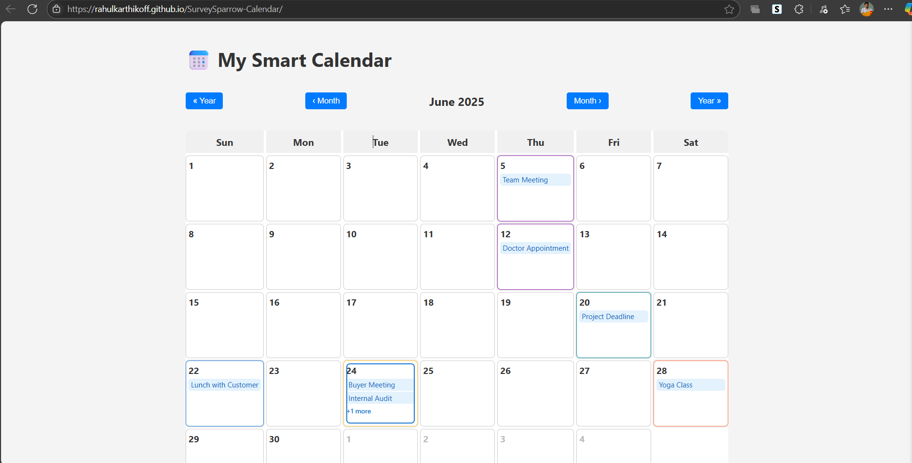
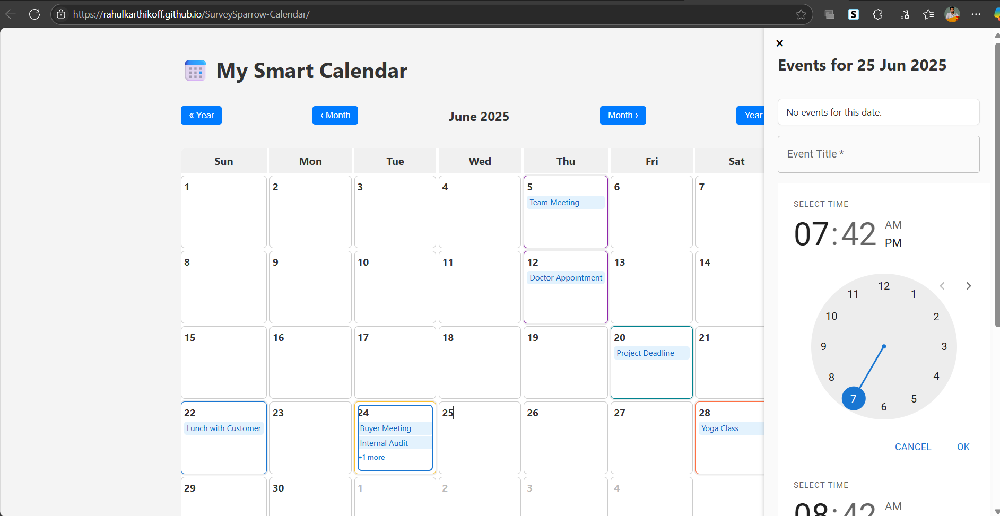
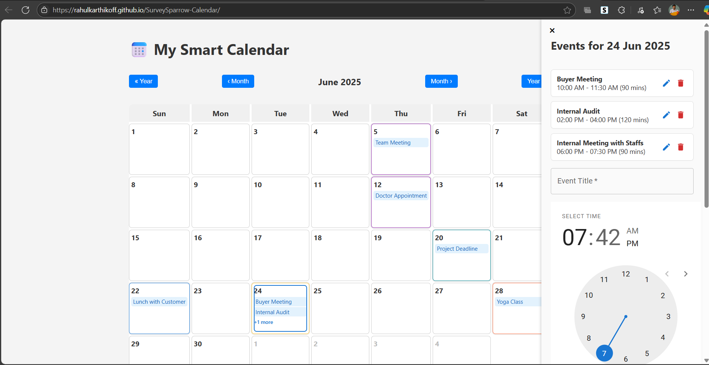

# 📅 My Smart Calendar

A modern, responsive calendar web app built with React and Material UI, featuring event management (add, edit, delete), month/year navigation, and a beautiful, mobile-friendly UI.

---

## ✨ Features

- **Responsive Calendar Grid**: Works great on desktop, tablets, and mobile (including foldables).
- **Month & Year Navigation**: Easily move between months and years.
- **Event Management**: Add, edit, and delete events for specific dates.
- **Event Sidebar**: View and manage events for the selected date in a sidebar.
- **Colorful Event Highlights**: Calendar cells with events are outlined in attractive colors.
- **Today Highlight**: The current date is outlined for quick reference.
- **Static Demo Events**: The app comes with sample events for instant demo.
- **Material UI Design**: Clean, accessible, and familiar interface.

---

## 🛠️ Tech Stack

- **React** (with hooks)
- **Material UI (MUI)** for components and icons
- **Day.js** for date manipulation
- **CSS** for custom responsive styling

---


## 🌐 Live Demo

**Try it now:**  
[https://rahulkarthikoff.github.io/SurveySparrow-Calendar/](https://rahulkarthikoff.github.io/SurveySparrow-Calendar/)

---

## 📸 Screenshots

### Calendar View (Desktop)


### Add Event


### View Event



---

## 🚀 Getting Started

1. **Clone the repository:**
   ```bash
   git clone https://github.com/Rahulkarthikoff/SurveySparrow-Calendar.git
   cd myCalendar
   ```

2. **Install dependencies:**
   ```bash
   npm install
   ```

3. **Run the app:**
   ```bash
   npm start
   ```

4. **Open in your browser:**
   ```
   http://localhost:5173
   ```

---

## 📝 Usage

- **Navigate Months/Years:** Use the navigation buttons above the calendar.
- **View Events:** Click any date to open the sidebar and see events for that day.
- **Add Event:** Click "+ Add Event" in the sidebar, fill in the details, and save.
- **Edit Event:** Click the pencil (edit) icon next to an event.
- **Delete Event:** Click the trash (delete) icon next to an event.
- **Responsive:** Try resizing your browser or using device emulation to see the responsive design.

---

## 📂 Project Structure

```
my-smart-calendar/
├── public/
│   └── images/
├── src/
│   ├── components/
│   │   ├── Calendar.jsx
│   │   ├── Calendar.css
│   │   ├── EventSidebar.jsx
│   │   ├── EventSidebar.css
│   │   └── MonthNavigator.jsx
│   ├── App.jsx
│   └── App.css
├── package.json
└── README.md
```

---

## 📅 Demo Events

The app includes static demo events on random dates in the current month for instant preview. You can add, edit, or delete events as you wish.

---

## 📱 Responsive Design

- **Desktop:** Sidebar slides in from the right.
- **Tablet/Foldable:** Sidebar adapts width and layout.
- **Mobile:** Sidebar slides up from the bottom, calendar and controls resize for touch.

---

## 🤝 Contributing

Pull requests are welcome! For major changes, please open an issue first to discuss what you would like to change.

---

## 📄 License

MIT

---

## 🙏 Acknowledgements

- [Material UI](https://mui.com/)
- [Day.js](https://day.js.org/)
- [React](https://react.dev/)

---

